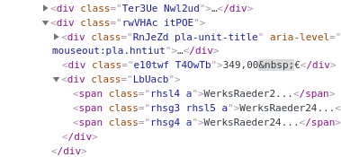
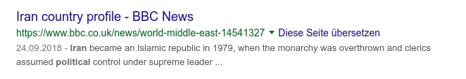

# Struktur

A javascript module that recognizes a recurring structure in rendered HTML pages without any manual rules. Outputs JSON.

**Struktur** puts an end to web scraping / information extraction with painful CSS selectors / XPath queries. Struktur finds collections of items with similar structure. In the overwhelming majority of cases, this is the data you need.

### Examples

1. [See image of Structures in Google SERP as PNG](https://github.com/NikolaiT/struktur/examples/google.png). Extracted [data as JSON](https://github.com/NikolaiT/struktur/examples/google.json).
2. [Highlighted Structures in Bing SERP as PNG](https://github.com/NikolaiT/struktur/examples/bing.png) and the [Data as JSON file](https://github.com/NikolaiT/struktur/examples/bing.json).
3. [Product Structures of Amazon as PNG](https://github.com/NikolaiT/struktur/examples/amazon.png) and the [JSON file](https://github.com/NikolaiT/struktur/examples/amazon.json).
4. [Ebay Product Structures as PNG](https://github.com/NikolaiT/struktur/examples/ebay.png) and the the [JSON file](https://github.com/NikolaiT/struktur/examples/ebay.json).
5. [Google News Structures as PNG](https://github.com/NikolaiT/struktur/examples/google_news.png) and the the [JSON file](https://github.com/NikolaiT/struktur/examples/google_news.json).

### Terminology

1. A **structure** is a collection/list of at least `N` **objects**.
2. An **object** is a array of text, links with text and images elements that are visible in the DOM. An object should at least include a link with text.
3. An **element** is the abstract name for all those links, texts, images.

### Usage

You will need to use puppeteer in order to get javascript access to rendered DOM

```js
// puppeteer-extra is a drop-in replacement for puppeteer,
// it augments the installed puppeteer with plugin functionality
const puppeteer = require("puppeteer-extra");

// add stealth plugin and use defaults (all evasion techniques)
const pluginStealth = require("puppeteer-extra-plugin-stealth");
puppeteer.use(pluginStealth());

const config = {
    urls: {
        'google': 'https://www.google.de/search?q=europe+news',
    },
    chrome_flags: [
        '--disable-infobars',
        '--window-position=0,0',
        '--ignore-certifcate-errors',
        '--ignore-certifcate-errors-spki-list',
        '--window-size=1920,1040',
        '--start-fullscreen',
        '--hide-scrollbars',
        '--disable-notifications',
    ],
};

puppeteer.launch({ headless: false, args: config.chrome_flags }).then(async browser => {
    const page = await browser.newPage();
    await page.setBypassCSP(true);
    await page.setViewport({ width: 1920, height: 1040 });
    await page.goto(config.urls.google, {waitUntil: 'networkidle0'});

    await page.waitFor(1000);

    await page.addScriptTag({path: 'struktur.js'});

    var results = await page.evaluate(() => {
        return struktur({
            N: 7,
            highlightStruktur: true,
            highlightContent: true,
            addClass: false,
        });
    });

    await page.waitFor(1000);
    console.log(results);

    await browser.close();
});
```

## Motivation

There are two reasons why web scraping is painful

#### 1. CSS Selectors and XPath queries suck big time
 
Finding good CSS selectors and XPath queries to target information on web sites is a strenuous task. Often the same data is rendered in slightly different markup under different conditions. This means that we often need different versions of CSS selectors / Xpath for the same targeted information. The markup of websites changes frequently and the maintaining of those selectors is soul crushing.




#### 2. Getting blocked based on IP address, headers, captchas, missing javascript capabilities

The other painful reality of web scraping is getting blocked by web sites. There is a complete industry with companies such as Distil and Incapsula that develop anti scraping software. In 2019, advanced scraping is almost always done with real browsers that are controlled with software such as puppeteer or nightmarejs.  The reasons for that is that we want to behave like real humans. Real humans do not browse websites with curl. Instead, real humans have javascript enabled and real humans use something that renders HTML/CSS/JS (that thing is called *browser*).

While we can solve the second problem only with more resources, we can solve the first problem algorithmically. The only condition is that we need to render the pages that we want to scrape, therefore we need to scrape using headless browsers.

We need an abstract algorithm that automatically detects relevant structure in rendered web pages.


## What is *relevant* structure?

Relevant structure is a collection of similar objects which are of interest. 

+ The Google Search Engine has 10 results objects that consist of a title, link and snippet.
+ The amazon product search results page has many products that are rendered in a grid system and each share a product image, price and title.
+ News sites present their headlines on a frontpage. Each headline consists of a title (with link to the story), description and potentially author name and publication date.

All those items have a common structure when interpretted visually: They have more or less 
the same vertical alignment, the same font size, the same html tags and so on.

The huge problem however is that this structure is created dynamically from the interplay of HTML, JavaScript and CSS. This means that the HTML structure does not necessarily need to resemble the visual output.


## What assumptions does Struktur make?

1. The input of **Struktur** is a website rendered by a modern browser with javascript support. We will use puppeteer to render websites. 
2. We assume that structure is what humans consider to be related structure. 
	+ Identical horizontal/vertical alignment among objects
	+ More or less same size of bounding rectangles of the object of interest
	+ As output we are merely interested in *Links*, *Text* and Images (which are Links). The output needs to be visible.
	+ Only structure that takes a major part of the visible viewport is considered structure
	+ There must be at least N=5 related elements

Those assumptions are important. 

When websites protect themselves against web scraping by randomizing class names, injecting dummy HTML content, creating duplicate elements, dynamically altering the contents of the site, they still need to present a website that can be visually interpreted by the non malicious visitor. **Struktur** makes use of this fact.

## What does Struktur output?

*Struktur* outputs JSON with the parsed structure from a URL that is was fed. 


## High level algorithm overview

Take a starting node as input. If no node is given, use the `body` element.

See if the element contains at least N identical elements (such as `div`, `article`, `li`, `section`, ...). If yes, mark those child nodes
as potential structure candidates.

Visit the next node in the tree and check again for N identical elements.

After all candidates have been found, get the bonding boxes of the candidates with `getBoundingClientRect()`

If the bounding boxes vertically and horizontally align and have more or less identical dimensions *and* make up 
a significant part of `document.body.getBoundingClientRect()`, add those elements to the potential structures.

In the next stage we compare the items within the potential structures. If they share *common characteristics*, we consider those elements to form a valid structure. We are only interested in `img`, `a` and textNodes. Furthermore, we are only interested in visible textNodes.


## Open Problems 


### Recognizing Text Nodes that belong together

Often we have text that is visually rendered as coherent but crafted with nexted text nodes and html elements. 

Example:

```html
<span class="st">
Beschreibung. Holz <em>Rahmen Haus</em>. Holz <em>Rahmen Haus</em>, FSC Mix Credit, 22 x 24 x 2,5 cm, mit 6 Haken + Anhänger. Das Holzrahmen <em>Haus</em> wird in Naturfarbe&nbsp;...
</span>
```

The html above is the Google Snippet for a SERP result. It is not obvious how to parse this mix of elements and text nodes. On the one hand we would obviously like to retrieve the whole snippet as text

```
Beschreibung. Holz Rahmen Haus. Holz Rahmen Haus, FSC Mix Credit, 22 x 24 x 2,5 cm, mit 6 Haken + Anhänger. Das Holzrahmen Haus wird in Naturfarbe ...
```

But what happens when we have such a snippet:

```html
<span class="st">
<span class="f">24.09.2018 - </span><em>Iran</em> became an Islamic republic in 1979, when the monarchy was overthrown and clerics assumed <em>political</em> control under supreme leader&nbsp;...
</span>
```



When we proceed with the same strategy, we will also include the **date** *24.09.2018* in the text content. However, it would be much better to parse the data separately for data analysis reasons.

The main question is: How to parse visually coherent text in rendered html? 

We humans instinctively parse the above snippet into 3 components, based on the following criteria:

1. We (people from the west) read from top-left to bottom-right
2. We partition based on font size, font weight and font color

Struktur will most likely adopt a hybrid strategy: We will parse each text node individually, but when struktur encounters text that *appears* to belong together, it will suggest a coherent solution.


### Remove elements that do not belong to the structure

Create a filter that rejects objects in structures that do not match with the majority of other objects. This is a clustering problem and not trivial.

One simple idea is to reject structures that do not have at least a link in text in their structures.